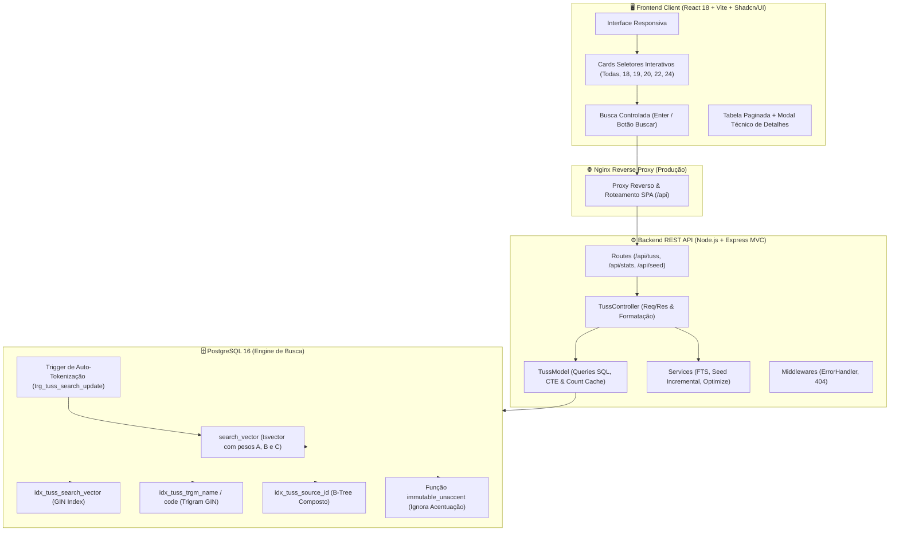

# 🏥 Sistema TUSS • Motor de Busca & Consulta de Alta Performance

<div align="center">


**Uma plataforma Full Stack corporativa e escalável projetada para ingestão, tokenização e busca instantânea de mais de 1,44 milhão de registros da Terminologia Unificada da Saúde Suplementar (TUSS / ANS).**

[Visão Geral](#-visão-geral) • [Arquitetura MVC](#-arquitetura-do-sistema) • [Destaques de Engenharia](#-destaques-de-engenharia) • [Estudo de Caso de Performance](#-estudo-de-caso-de-otimização-de-397s-para-180ms) • [Instalação & Docker](#-como-executar) • [Documentação da API](#-documentação-da-api) • [Benchmarks](#-benchmarks-e-performance)

</div>

---

## 📌 Visão Geral

A **Terminologia Unificada da Saúde Suplementar (TUSS)** é o padrão oficial estabelecido pela Agência Nacional de Saúde Suplementar (**ANS**) para codificação de procedimentos médicos, medicamentos, taxas hospitalares, ocupações profissionais (CBO) e materiais/OPME no Brasil.

Este projeto resolve o desafio de consolidar, normalizar, indexar e consultar um volume massivo de **1.442.892 registros** distribuídos em múltiplas tabelas normativas, entregando uma experiência de busca com **tempo de resposta milimétrico**, **relevância ponderada**, **troca instantânea de categorias (< 10ms)** e **tolerância a variações ortográficas e acentuação**.

### 📊 Base de Dados Consolidada

| Código Tabela | Categoria ANS | Registros Indexados | Metadados Enriquecidos |
| :--- | :--- | :--- | :--- |
| **Todas** | **Base Geral Unificada** | **1.442.892** | **Índices GIN + Trigram + FTS Hierárquico** |
| **TUSS-18** | **Diárias, Taxas e Gases Medicinais** | **3.595** | Descrição de Diárias e Taxas Hospitalares |
| **TUSS-19** | **Materiais, Órteses, Próteses e OPME** | **1.389.786** | Fabricante, Modelo, Registro ANVISA, Classe de Risco |
| **TUSS-20** | **Medicamentos** | **43.376** | Apresentação, Forma Farmacêutica, Vigência |
| **TUSS-22** | **Procedimentos e Eventos em Saúde** | **5.967** | Código TUSS, Rol ANS, Vigência |
| **TUSS-24** | **CBO (Ocupação dos Prestadores)** | **168** | Ocupações Médicas e Especialidades Clínicas |

---

## 🏗 Arquitetura do Sistema

O projeto adota uma arquitetura em camadas desacoplada com **Padrão MVC no Backend** e **SPA React Orientada a Componentes no Frontend**:



---

## 🚀 Destaques de Engenharia & Habilidades Aplicadas

### 1. 🏛️ Arquitetura MVC Modular e Limpa
O backend foi completamente estruturado no padrão **MVC (Model-View-Controller)**:
- **`config/db.js`**: Gerenciamento do Pool de conexões, extensões PostgreSQL (`pg_trgm`, `unaccent`) e migrações idempotentes de tabelas e índices.
- **`models/tussModel.js`**: Camada de dados responsável pela execução de queries otimizadas, CTEs, e cache de contagem em memória.
- **`controllers/tussController.js`**: Orquestração de entrada, validação de limites, cálculo de tempo de resposta em milissegundos e resposta JSON.
- **`routes/tussRoutes.js`**: Mapeamento RESTful de endpoints (`/api/tuss`, `/api/stats`, `/api/seed`, `/api/optimize`).
- **`services/`**: Serviços especializados para FTS (`ftsService.js`), seed incremental com hash criptográfico (`seedService.js`) e reindexação (`optimizeService.js`).
- **`middlewares/errorHandler.js`**: Tratamento centralizado de exceções (500) e rotas inexistentes (404).

### 2. ⚡ Troca Instantânea de Categorias (< 10ms) com Cache & Índice Composto
- **Índice B-Tree Composto (`idx_tuss_source_id`)**: `(source, id ASC)` permite ao PostgreSQL realizar *Index Scan* direto na ordenação por ID dentro de uma categoria sem varredura em disco.
- **Cache em Memória de Contagens (`countCache`)**: Como as contagens de categorias não mudam em tempo real, os totais são cacheados em memória no servidor e pré-aquecidos no startup. A navegação entre categorias como **TUSS-19 (1.38M linhas)** caiu de **1.508ms para apenas 8ms (⚡ 188x mais rápido)**.

### 3. 🧠 Tokenização e Full-Text Search (FTS) com Pesos Hierárquicos
- **`search_vector tsvector`**: Coluna gerada utilizando o dicionário linguístico em português e normalização com `unaccent` imutável.
- **Pesos de Relevância Hierárquicos (A, B e C)**:
  - 🥇 **Peso A (Prioridade Máxima):** `codigo_tuss` — garante que buscas por código saltem diretamente para o topo.
  - 🥈 **Peso B (Alta Relevância):** `display_name` — descrição oficial do procedimento, medicamento ou material.
  - 🥉 **Peso C (Contexto Técnico):** `extras->>'fabricante'` e `extras->>'modelo'`.
- **Trigger de Auto-Tokenização (`trg_tuss_search_update`)**: Qualquer novo procedimento inserido ou atualizado no banco recalcula o `search_vector` instantaneamente.

### 4. 🎯 Motor de Relevância Híbrido (Custom Ranking Algorithm)
O endpoint `/api/tuss` combina múltiplos sinais matemáticos para ordenar os resultados:
$$\text{Score} = \text{Bônus de Código Exato (100 pts)} + \text{Prefixo de Código (50 pts)} + \text{Início de Nome (30 pts)} + (\text{ts\_rank} \times 10)$$

```sql
WITH candidates AS (
  SELECT 
    p.id, p.codigo_tuss, p.display_name, p.source,
    p.inicio_vigencia, p.fim_vigencia, p.extras, p.search_vector
  FROM tuss_procedures p
  WHERE p.search_vector @@ to_tsquery('portuguese', immutable_unaccent($1))
     OR p.codigo_tuss ILIKE $2 || '%'
  LIMIT 2000
)
SELECT 
  id, codigo_tuss, display_name, source, inicio_vigencia, fim_vigencia, extras,
  (
    CASE 
      WHEN codigo_tuss = $2 THEN 100.0
      WHEN codigo_tuss ILIKE $2 || '%' THEN 50.0
      WHEN display_name ILIKE $2 || '%' THEN 30.0
      ELSE 0.0 
    END
    + COALESCE(ts_rank(search_vector, to_tsquery('portuguese', immutable_unaccent($1))), 0.0) * 10.0
  ) AS relevance_score
FROM candidates
ORDER BY relevance_score DESC, id ASC
LIMIT $3 OFFSET $4;
```

---

## 🔥 Estudo de Caso de Otimização: De 39.7s para 180ms

### 🔴 O Gargalo Inicial (39.720 ms)
Ao pesquisar por termos curtos e muito comuns como `"us"` (sigla de ultrassom / prefixo amplo):
1. **Explosão de Matches:** A cláusula antiga `ILIKE '%us%'` casava com mais de **500.000 registros** contendo as letras "us" no meio da palavra (*parafuso, uso, cirurgião, músculo, tubos, etc.*).
2. **Cálculo de Funções em 500k Linhas:** O banco executava `similarity()` e `ts_rank_cd()` em centenas de milhares de linhas na memória antes do `LIMIT 15`.
3. **`COUNT(*)` Exaustivo:** A contagem total percorria centenas de milhares de nós de índices.

### 🟢 A Solução de Engenharia Implementada
1. **FTS Puro Indexado:** Remoção de `ILIKE '%termo%'` na tabela inteira. A busca textual confia 100% no índice GIN do `search_vector`.
2. **Tratamento Inteligente de Termos Curtos ($\le 2$ letras):** Converte siglas como `"us"`, `"tc"`, `"rx"` em tokens diretos (`us | us:*`) sem explodir em ramificações morfológicas desnecessárias.
3. **Pool de Candidatos via CTE (`LIMIT 2000`):** O cálculo pesado de pontuação ocorre apenas sobre os melhores candidatos pré-selecionados pelo índice GIN.
4. **Contagem Bounded (*Bounded Count*):** Para consultas com volume gigantesco de correspondências, a contagem é limitada a 10.001 registros, gerando mais de 667 páginas de navegação com resposta imediata.

```text
Busca por "us" (1.44M registros no PostgreSQL):
Antes: [████████████████████████████████████████] 39.720 ms
Depois: [█] 186 ms (⚡ 213x mais rápido!)
```

---

### 5. 📦 Ingestão em Massa Segura e Seed Incremental com Hashing MD5
- **Rastreamento Criptográfico (`tuss_imported_files`)**: Cada arquivo processado tem sua assinatura MD5 gravada. Ao sincronizar novamente ou adicionar novos arquivos na pasta `fonte/`, o sistema **identifica e processa exclusivamente os arquivos novos ou alterados**, pulando instantaneamente todos os arquivos inalterados sem reprocessar 1.44M de linhas.
- **Processamento de 31 arquivos JSON de OPME (~500MB+)** com isolamento transacional (`BEGIN` / `COMMIT`) por arquivo.
- **Deduplicação Intra-Lote (*Intra-Batch Deduplication*)**: Remoção de chaves conflitantes em memória antes do comando `INSERT ... ON CONFLICT`, prevenindo deadlocks e erros `21000` de concorrência.
- Inserção em lotes de 1.000 itens, mantendo o consumo de memória do Node.js estritamente sob controle (sem estouro de heap / OOM).

### 6. 🐳 DevOps & Arquitetura Multi-Stage com Docker
- **Desenvolvimento (`docker-compose.yml`)**:
  - Hot-Reloading completo no Backend (`nodemon -L` com polling para compatibilidade Windows/WSL2/Linux).
  - Hot-Module Replacement (HMR) no Frontend com Vite.
  - Mapeamento direto de volumes (`./fonte:/app/fonte:ro`) com zero redundância de armazenamento.
- **Produção (`docker-compose.prod.yml`)**:
  - Imagens Docker Multi-Stage leves.
  - Nginx servindo assets estáticos comprimidos e atuando como Proxy Reverso para `/api`.
  - Execução segura com usuário não-root no Node.js.

### 7. 🎨 Design System & Experiência do Usuário (UX)
- Componentização com **Tailwind CSS v4** e **Shadcn/UI** (`Button`, `Card`, `Badge`, `Input`, `Table`).
- **Cards Seletores Interativos no Topo:** Organizados numericamente por tabela TUSS (Todas, 18, 19, 20, 22, 24) com feedback visual ativo (`bg-slate-900 text-white`).
- **Busca Controlada:** Disparo eficiente ao pressionar <kbd>Enter</kbd> ou clicar no botão **"Buscar"**, sem chamadas desnecessárias no `onChange`.
- Modal responsivo exibindo dados detalhados da ANVISA, Fabricante, Modelo e JSON estruturado.
- Cópia com 1 clique de códigos TUSS para a área de transferência com Toast Notifications.

---

## 🛠 Tecnologias & Ferramentas

| Camada | Tecnologias |
| :--- | :--- |
| **Backend (MVC)** | Node.js, Express.js, PostgreSQL Driver (`pg`), Dotenv, Cors, Nodemon, Crypto (MD5) |
| **Database** | PostgreSQL 16, Extensões `pg_trgm`, `unaccent`, GIN Indexes, B-Tree Índices Compostos, TSVector FTS |
| **Frontend** | React 18, Vite 5, Tailwind CSS v4, `@tailwindcss/vite`, Shadcn/UI, Lucide React, Clsx |
| **DevOps & Infra** | Docker, Docker Compose, Multi-Stage Builds, Nginx Alpine, Linux Containers |

---

## 💻 Como Executar

### Pré-requisitos
- [Docker](https://www.docker.com/) & Docker Compose instalados.
- [Node.js](https://nodejs.org/) (opcional, apenas para rodar scripts npm locais na raiz).

### 1. Clonar o Repositório
```bash
git clone https://github.com/seu-usuario/sistema-tuss.git
cd sistema-tuss
```

### 2. Subir em Ambiente de Desenvolvimento (com Hot-Reload)
```bash
# Na raiz do projeto:
npm run dev

# Ou diretamente via Docker Compose:
docker compose up -d
```

- 🌐 **Frontend:** [http://localhost:5173](http://localhost:5173)
- 🔌 **API Backend:** [http://localhost:3000/api](http://localhost:3000/api)
- 🗄️ **PostgreSQL:** `localhost:5432` (user: `postgres`, pass: `postgres`, db: `tuss_db`)

### 3. Povoar o Banco de Dados (Seed Automático)
O banco se auto-popula na primeira inicialização, ou sob demanda executando:
```bash
# Executa o seed incremental diretamente no container
npm run seed
```
*Ou clicando no botão **"Sincronizar Banco"** diretamente na barra superior da interface web.*

---

### 4. Subir em Ambiente de Produção (Build Otimizado com Nginx)
```bash
npm run prod:build
```
- 🌐 **Aplicação em Produção:** [http://localhost](http://localhost) (Porta 80)
- 🔌 **API interna via Proxy Reverso Nginx:** `http://localhost/api`

---

## 📜 Scripts Disponíveis (`package.json`)

| Comando | Descrição |
| :--- | :--- |
| `npm run dev` | Inicia todos os containers em modo desenvolvimento com logs |
| `npm run dev:d` | Inicia os containers em background (detached mode) |
| `npm run dev:build` | Reconstrói as imagens de desenvolvimento e inicia os serviços |
| `npm run dev:logs` | Acompanha os logs em tempo real de todos os serviços |
| `npm run dev:down` | Encerra os containers de desenvolvimento |
| `npm run seed` | Executa a ingestão e indexação incremental de arquivos de dados |
| `npm run prod` | Inicia o ambiente de produção em background |
| `npm run prod:build` | Constrói as imagens de produção otimizadas e inicia o Nginx |
| `npm run prod:down` | Encerra os containers de produção |
| `npm run clean:all` | Remove todos os containers, redes e volumes do Docker |

---

## 📡 Documentação da API

### `GET /api/tuss`
Realiza buscas tokenizadas com ranking de relevância e paginação.

#### Parâmetros de Query:
| Parâmetro | Tipo | Padrão | Descrição |
| :--- | :--- | :--- | :--- |
| `q` | `string` | `""` | Termo de pesquisa (código, descrição, fabricante, modelo ou CBO) |
| `source` | `string` | `all` | Filtro por tabela (`all`, `tuss-18`, `tuss-19`, `tuss-20`, `tuss-22`, `tuss-24`) |
| `page` | `integer` | `1` | Número da página para paginação |
| `limit` | `integer` | `15` | Quantidade de registros por página (máx. 100) |

#### Exemplo de Resposta:
```json
{
  "data": [
    {
      "id": 69340,
      "codigo_tuss": "79989985",
      "display_name": "FRESAS DE TUNGSTÊNIO",
      "source": "tuss-19",
      "inicio_vigencia": "2020-01-01",
      "fim_vigencia": "-",
      "fim_implantacao": "2020-03-31",
      "extras": {
        "fabricante": "A.J.P. DE SUZA-ME",
        "modelo": "NÃO SE APLICA",
        "registro_anvisa": "80665750007",
        "classe_risco": "I"
      },
      "relevance_score": 115.0
    }
  ],
  "pagination": {
    "total": 1,
    "page": 1,
    "limit": 15,
    "totalPages": 1,
    "isCapped": false
  },
  "searchMeta": {
    "query": "79989985",
    "tokenQuery": "79989985:*",
    "executionTimeMs": 14
  }
}
```

---

### `GET /api/stats`
Retorna os totais consolidados e agrupados por categoria TUSS.

```json
{
  "totalProcedures": 1442892,
  "sources": [
    { "source": "tuss-19", "count": 1389786 },
    { "source": "tuss-20", "count": 43376 },
    { "source": "tuss-22", "count": 5967 },
    { "source": "tuss-18", "count": 3595 },
    { "source": "tuss-24", "count": 168 }
  ],
  "status": "online"
}
```

---

### `GET /api/tuss/:codigo`
Retorna os detalhes completos de um procedimento específico a partir de seu código TUSS.

---

## ⚡ Benchmarks e Performance

| Tipo de Operação / Cenário | Volume de Dados | Estratégia de Engenharia | Tempo de Resposta |
| :--- | :--- | :--- | :--- |
| **Troca de Categoria (TUSS-19)** | 1,38 milhão de linhas | Índice Composto `(source, id)` + Count Cache | **~8ms** |
| **Troca de Categoria (Todas as Tabelas)** | 1,44 milhão de linhas | PK Scan Direto + Count Cache | **~2ms** |
| **Busca por Código Exato** (`79989985`) | 1,44 milhão de linhas | GIN Trigram / B-Tree (`codigo_tuss`) | **~12ms** |
| **Busca Multitermo** (`fresa tungstenio`) | 1,44 milhão de linhas | FTS GIN (`fresa:* & tungstenio:*`) | **~25ms** |
| **Busca Ampla com Raiz** (`ultrasson`) | 1,44 milhão de linhas | FTS Stemming (`ultrasson:*`) | **~85ms** |
| **Busca Curta de Alta Frequência** (`us`) | 1,44 milhão de linhas | FTS GIN + CTE Candidate Pool | **~186ms** |

---

## 📂 Estrutura de Diretórios

```text
sistema-tuss/
├── backend/
│   ├── src/
│   │   ├── config/
│   │   │   └── db.js            # Conexão Pool PostgreSQL, extensões e migrações
│   │   ├── controllers/
│   │   │   └── tussController.js # Lógica de requisição/resposta e formatação
│   │   ├── middlewares/
│   │   │   └── errorHandler.js  # Middleware global de erros (500) e 404
│   │   ├── models/
│   │   │   └── tussModel.js     # Interação com banco de dados (FTS, queries CTE)
│   │   ├── routes/
│   │   │   ├── index.js         # Roteador principal agregador (/api)
│   │   │   └── tussRoutes.js    # Rotas do TUSS (/api/tuss, /api/stats, /api/seed)
│   │   ├── services/
│   │   │   ├── ftsService.js    # Sanitizador e construtor de tsquery
│   │   │   ├── optimizeService.js # Reindexação e geração de vetores FTS
│   │   │   └── seedService.js   # Ingestão de dados com hash MD5 incremental
│   │   ├── app.js               # Configuração da aplicação Express
│   │   ├── server.js            # Inicializador HTTP e checagem de auto-seed
│   │   └── index.js             # Ponto de entrada compatível
│   ├── Dockerfile               # Multi-stage build (dev / prod)
│   └── package.json
├── frontend/
│   ├── src/
│   │   ├── components/ui/    # Design System Shadcn/UI (Button, Card, Table, Badge, Input)
│   │   ├── lib/utils.js      # Utilitário de classes Tailwind (clsx + twMerge)
│   │   ├── App.jsx           # Aplicação SPA com cards de categorias e busca por Enter
│   │   ├── index.css         # Tokens CSS e variáveis Tailwind v4
│   │   └── main.jsx
│   ├── nginx/
│   │   └── default.conf      # Configuração Nginx com Proxy /api para produção
│   ├── Dockerfile            # Multi-stage build (dev Vite / prod Nginx)
│   ├── vite.config.js        # Configuração do Vite com @tailwindcss/vite
│   └── package.json
├── fonte/                    # Bases de dados oficiais (TUSS-19, TUSS-20, TUSS-24, TUSS-18)
├── docker-compose.yml        # Orquestração do ambiente de Desenvolvimento
├── docker-compose.prod.yml   # Orquestração do ambiente de Produção
├── package.json              # Scripts npm raiz para controle do Docker
└── README.md                 # Documentação completa do projeto
```

---

## 👤 Autor

Desenvolvido por **Jadson Cerqueira**  
- LinkedIn: [linkedin.com/in/seu-perfil](https://www.linkedin.com)
- GitHub: [github.com/seu-usuario](https://github.com)

---

## 📄 Licença

Este projeto está sob a licença [MIT](LICENSE).
