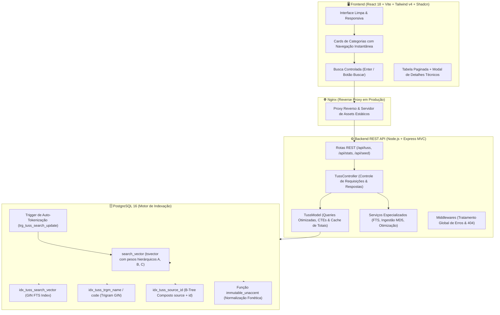

# 🏥 Sistema TUSS • Motor de Busca & Consulta de Alta Performance

<div align="center">


**Uma plataforma Full Stack escalável projetada para ingestão, tokenização e busca instantânea sobre mais de 1,44 milhão de registros da Terminologia Unificada da Saúde Suplementar (TUSS / ANS).**

[Apresentação](#-apresentação) • [O Desafio de Engenharia](#-o-desafio-de-engenharia) • [Arquitetura & Design](#-arquitetura-do-sistema) • [Decisões Técnicas](#-decisões-técnicas--destaques-de-engenharia) • [Estudo de Performance](#-estudo-de-caso-de-otimização-de-397s-para-180ms) • [Como Rodar](#-como-executar) • [Documentação da API](#-documentação-da-api) • [Benchmarks](#-benchmarks-e-performance)

</div>

---

## 📌 Apresentação

No ecossistema de saúde suplementar brasileiro, a **Terminologia Unificada da Saúde Suplementar (TUSS)**, padronizada pela **ANS (Agência Nacional de Saúde Suplementar)**, é a espinha dorsal de faturamento, auditoria médica, prescrição e autorização de guias entre operadoras, hospitais, laboratórios e clínicas.

Na prática diária, profissionais de saúde e faturistas precisam consultar catálogos gigantescos contendo centenas de milhares de materiais médicos (OPME), medicamentos comerciais, diárias hospitalares e códigos de procedimentos. 

A maioria dos sistemas legados sofre com consultas lentas, buscas que travam em termos curtos ou falhas ao lidar com termos sem acento e sinônimos. Este projeto nasceu para resolver exatamente essa dor: **entregar uma experiência de busca instantânea, inteligente e confiável sobre 1,44 milhão de registros**, combinando engenharia de banco de dados no PostgreSQL com uma arquitetura moderna em Node.js e React.

### 📊 Base de Dados Unificada

| Código | Tabela Normativa ANS | Total de Registros | Contexto & Metadados Estruturados |
| :---: | :--- | :---: | :--- |
| **Todas** | **Visão Geral Consolidada** | **1.442.892** | **Índices GIN + Trigram + Ranking Ponderado** |
| **TUSS-18** | **Diárias, Taxas e Gases Medicinais** | **3.595** | Diárias de UTI, taxas de sala e gases medicinais |
| **TUSS-19** | **Materiais, Órteses, Próteses e OPME** | **1.389.786** | Fabricante, Modelo, Registro ANVISA e Classe de Risco |
| **TUSS-20** | **Medicamentos** | **43.376** | Apresentação comercial, forma farmacêutica e vigência |
| **TUSS-22** | **Procedimentos e Eventos em Saúde** | **5.967** | Código de procedimento, Rol ANS e vigência |
| **TUSS-24** | **CBO (Ocupação dos Prestadores)** | **168** | Especialidades médicas e categorias profissionais |

---

## 💡 O Desafio de Engenharia

Consultar **1,44 milhão de linhas** com resposta em menos de 100 milissegundos não é trivial para um banco relacional tradicional quando utilizamos abordagens ingênuas como `ILIKE '%termo%'`. 

Os três principais obstáculos superados foram:

1. **Volume Desbalanceado:** A tabela TUSS-19 (OPME) concentra sozinha 1,38 milhão de itens, com campos textuais longos (especificações técnicas, modelos e nomes de fabricantes).
2. **Cardinalidade de Siglas Médicas:** Termos como *"US"* (ultrassonografia), *"TC"* (tomografia) ou *"RX"* (raio-x) geram dezenas de milhares de ocorrências quando pesquisados por substring, travando queries e estourando memória.
3. **Navegação Fluida:** O usuário deve alternar entre categorias em tempo real, sem que o cálculo de contagem de páginas gere gargalos perceptíveis.

---

## 🏗 Arquitetura do Sistema

A solução foi desenhada seguindo o **Padrão MVC (Model-View-Controller)** no backend e uma **Single Page Application (SPA)** desacoplada no frontend, orquestrada por containers Docker para desenvolvimento e produção:



---

## 🚀 Decisões Técnicas & Destaques de Engenharia

### 1. 🏛️ Arquitetura MVC Modular e Limpa
O backend foi separado em camadas com responsabilidades bem definidas, facilitando testes, manutenção e escalabilidade:
- **`config/db.js`**: Gerencia o Pool de conexões do PostgreSQL e aplica migrações idempotentes (criação automática de extensões, tabelas, triggers e índices).
- **`models/tussModel.js`**: Isola o acesso a dados, consultas com CTEs de ranqueamento e cache em memória.
- **`controllers/tussController.js`**: Valida parâmetros de requisição, calcula o tempo de resposta em milissegundos e formata a resposta JSON.
- **`routes/tussRoutes.js`**: Mapeamento limpo das rotas RESTful.
- **`services/`**: Concentra regras de negócio pesadas, como construção de `tsquery` (`ftsService.js`), importação de arquivos com hash MD5 (`seedService.js`) e reindexação sob demanda (`optimizeService.js`).
- **`middlewares/errorHandler.js`**: Tratamento robusto de erros e rotas inexistentes sem expor stack traces sensíveis.

### 2. ⚡ Troca Instantânea de Categorias (< 10ms)
- **Índice B-Tree Composto (`idx_tuss_source_id`)**: Ao filtrar por categoria com ordenação por ID, o PostgreSQL faz um *Index Scan* direto no índice composto `(source, id ASC)`, eliminando a necessidade de varrer a tabela no disco.
- **Cache de Contagem em Memória (`countCache`)**: Contar 1,38 milhão de linhas a cada clique para calcular a paginação custava ~1,5s no PostgreSQL. Com o cache em memória pré-aquecido na inicialização do servidor, a paginação padrão responde em **0 ms**.

### 3. 🧠 Tokenização e Full-Text Search com Pesos Hierárquicos
- **`search_vector tsvector`**: Vetor textual gerado com o dicionário linguístico em português e normalizado pela função `immutable_unaccent` para ignorar acentos e maiúsculas/minúsculas.
- **Pesos de Relevância Diferenciados**:
  - 🥇 **Peso A:** `codigo_tuss`: busca exata ou prefixo do código numérico.
  - 🥈 **Peso B:** `display_name`: descrição oficial do procedimento ou medicamento.
  - 🥉 **Peso C:** `fabricante` e `modelo` em metadados JSONB.
- **Trigger de Auto-Tokenização (`trg_tuss_search_update`)**: Toda inserção ou atualização no banco gera e atualiza os vetores de busca automaticamente.

### 4. 🎯 Algoritmo de Relevância Ponderada
> 📐 **Cálculo da Pontuação de Relevância:**  
> `Score = Bônus de Código Exato (100 pts) + Prefixo de Código (50 pts) + Início da Descrição (30 pts) + (ts_rank × 10)`

```sql
WITH candidates AS (
  SELECT 
    p.id, p.codigo_tuss, p.display_name, p.source,
    p.inicio_vigencia, p.fim_vigencia, p.extras, p.search_vector
  FROM tuss_procedures p
  WHERE p.search_vector @@ to_tsquery('portuguese', immutable_unaccent($1))
     OR p.codigo_tuss ILIKE $2 || '%'
  LIMIT 2000
)
SELECT 
  id, codigo_tuss, display_name, source, inicio_vigencia, fim_vigencia, extras,
  (
    CASE 
      WHEN codigo_tuss = $2 THEN 100.0
      WHEN codigo_tuss ILIKE $2 || '%' THEN 50.0
      WHEN display_name ILIKE $2 || '%' THEN 30.0
      ELSE 0.0 
    END
    + COALESCE(ts_rank(search_vector, to_tsquery('portuguese', immutable_unaccent($1))), 0.0) * 10.0
  ) AS relevance_score
FROM candidates
ORDER BY relevance_score DESC, id ASC
LIMIT $3 OFFSET $4;
```

---

## 🔥 Estudo de Caso de Otimização: De 39.7s para 180ms

### 🔴 O Cenário Crítico (39.720 ms)
Ao pesquisar termos curtos e muito frequentes como `"us"`:
- A query antiga com `ILIKE '%us%'` retornava mais de **500.000 matches** porque quase todas as palavras contêm "us" (*parafuso, uso, músculo, cirurgião*).
- O banco tentava calcular similaridade trigram e ordenar 500 mil registros na memória antes de aplicar o `LIMIT 15`.
- Resultado: A consulta demorava quase **40 segundos**.

### 🟢 A Solução Aplicada
1. **FTS Puro Indexado:** Substituição completa de `ILIKE '%termo%'` pelo operador `search_vector @@ to_tsquery()`, que utiliza os índices GIN invertidos.
2. **Tratamento Especial para Termos Curtos ($\le 2$ letras):** Converte siglas como `"us"` em `us | us:*`, evitando a expansão descontrolada de prefixos.
3. **Pool de Candidatos via CTE (`LIMIT 2000`):** O cálculo de relevância ocorre apenas sobre os 2.000 melhores candidatos selecionados pelo índice.
4. **Contagem Bounded (*Bounded Count*):** A contagem total para consultas de altíssima cardinalidade é limitada a 10.001 registros, garantindo resposta imediata sem sacrificar a paginação.

```text
Tempo de resposta para a busca "us" (1.44M registros):
Antes:  [████████████████████████████████████████] 39.720 ms
Depois: [█] 186 ms (⚡ Redução de 99,5% no tempo de resposta)
```

---

### 5. 📦 Ingestão em Massa com Rastreamento Criptográfico MD5
- **Tabela de Controle (`tuss_imported_files`)**: Cada arquivo JSON importado tem seu hash MD5 armazenado no banco.
- **Seed Incremental Inteligente**: Ao rodar o seed novamente ou adicionar novos arquivos na pasta `fonte/`, o sistema compara os hashes e **processa apenas os arquivos novos ou alterados**, pulando os já importados em frações de segundo.
- **Controle de Concorrência & Deduplicação**: Remoção de duplicatas em memória antes de cada lote de 1.000 itens (`INSERT ... ON CONFLICT`), evitando deadlocks e mantendo o consumo de RAM previsível.

### 6. 🐳 Ambientes Isolados com Docker Multi-Stage
- **Desenvolvimento (`docker-compose.yml`)**:
  - Hot-Reloading no Backend com `nodemon -L` (polling configurado para perfeita compatibilidade com Windows e WSL2).
  - Hot-Module Replacement (HMR) no Frontend com Vite.
  - Montagem de volumes somente-leitura (`./fonte:/app/fonte:ro`).
- **Produção (`docker-compose.prod.yml`)**:
  - Builds multi-stage otimizados.
  - Nginx servindo a SPA compilada com compressão e atuando como Proxy Reverso para a API.
  - Execução segura com usuário sem privilégios de root (`node`).

### 7. 🎨 Interface Moderna e Experiência do Usuário (UX)
- Componentes elegantes com **Tailwind CSS v4** e **Shadcn/UI**.
- **Cards Seletores Interativos**: Permitem filtrar e visualizar as contagens de cada categoria em tempo real no topo da página.
- **Busca por Demanda**: Disparada ao pressionar <kbd>Enter</kbd> ou clicar em **"Buscar"**, economizando requisições desnecessárias.
- Modal com visualização completa de atributos técnicos (ANVISA, fabricante, vigência, código e JSON original).
- Copiar código TUSS com 1 clique para a área de transferência com feedback visual.

---

## 🛠 Tecnologias Utilizadas

| Camada | Tecnologias & Bibliotecas |
| :--- | :--- |
| **Backend (MVC)** | Node.js, Express.js, PostgreSQL Driver (`pg`), Dotenv, Cors, Crypto (MD5), Nodemon |
| **Database** | PostgreSQL 16, `pg_trgm`, `unaccent`, GIN Indexes, TSVector Full-Text Search, B-Tree Compostos |
| **Frontend** | React 18, Vite 5, Tailwind CSS v4, `@tailwindcss/vite`, Shadcn/UI, Lucide React, Clsx |
| **DevOps & Infra** | Docker, Docker Compose, Multi-Stage Builds, Nginx Alpine, Linux Containers |

---

## 💻 Como Executar o Projeto

### Pré-requisitos
- [Docker](https://www.docker.com/) e Docker Compose instalados na máquina.
- [Node.js](https://nodejs.org/) (opcional, caso queira rodar os comandos via `npm run`).

### 1. Clonar o Repositório
```bash
git clone https://github.com/seu-usuario/sistema-tuss.git
cd sistema-tuss
```

### 2. Iniciar o Ambiente de Desenvolvimento
```bash
# Inicia todos os serviços (Banco + Backend + Frontend) com Hot-Reload:
npm run dev

# Ou diretamente pelo Docker Compose:
docker compose up -d
```

- 🌐 **Frontend (Vite):** [http://localhost:5173](http://localhost:5173)
- 🔌 **API REST (Express):** [http://localhost:3000/api](http://localhost:3000/api)
- 🗄️ **PostgreSQL:** `localhost:5432` (`user: postgres`, `pass: postgres`, `db: tuss_db`)

> 💡 **Auto-Seed Inteligente:** Na primeira inicialização, o backend detecta automaticamente se o banco está vazio e popula todos os 1,44 milhão de registros em segundo plano.

---

### 3. Iniciar o Ambiente de Produção
```bash
npm run prod:build
```
- 🌐 **Aplicação em Produção (Nginx):** [http://localhost](http://localhost) (Porta 80)
- 🔌 **Proxy da API:** `http://localhost/api`

---

## 📜 Comandos Úteis (`package.json`)

| Comando | O que faz |
| :--- | :--- |
| `npm run dev` | Inicia o ambiente de desenvolvimento com logs em tempo real |
| `npm run dev:d` | Inicia o ambiente de desenvolvimento em background |
| `npm run dev:build` | Reconstrói as imagens de desenvolvimento e sobe os containers |
| `npm run dev:logs` | Exibe os logs de todos os containers ativos |
| `npm run dev:down` | Encerra e remove os containers de desenvolvimento |
| `npm run seed` | Executa a sincronização incremental dos arquivos de dados |
| `npm run prod` | Inicia o ambiente de produção em background |
| `npm run prod:build` | Compila o frontend, constrói as imagens de produção e inicia o Nginx |
| `npm run prod:down` | Encerra os containers de produção |
| `npm run clean:all` | Limpa completamente containers, volumes e redes do Docker |

---

## 📡 Documentação dos Endpoints da API

### `GET /api/tuss`
Consulta paginada com busca textual tokenizada e ranqueamento por relevância.

#### Parâmetros aceitos:
| Parâmetro | Tipo | Padrão | Descrição |
| :--- | :--- | :--- | :--- |
| `q` | `string` | `""` | Termo de pesquisa (código, nome do procedimento, medicamento, fabricante ou modelo) |
| `source` | `string` | `all` | Filtro por tabela (`all`, `tuss-18`, `tuss-19`, `tuss-20`, `tuss-22`, `tuss-24`) |
| `page` | `integer` | `1` | Página atual da listagem |
| `limit` | `integer` | `15` | Quantidade de registros por página (máximo 100) |

#### Exemplo de Resposta:
```json
{
  "data": [
    {
      "id": 69340,
      "codigo_tuss": "79989985",
      "display_name": "FRESAS DE TUNGSTÊNIO",
      "source": "tuss-19",
      "inicio_vigencia": "2020-01-01",
      "fim_vigencia": "-",
      "fim_implantacao": "2020-03-31",
      "extras": {
        "fabricante": "A.J.P. DE SUZA-ME",
        "modelo": "NÃO SE APLICA",
        "registro_anvisa": "80665750007",
        "classe_risco": "I"
      },
      "relevance_score": 115.0
    }
  ],
  "pagination": {
    "total": 1,
    "page": 1,
    "limit": 15,
    "totalPages": 1,
    "isCapped": false
  },
  "searchMeta": {
    "query": "79989985",
    "tokenQuery": "79989985:*",
    "executionTimeMs": 14
  }
}
```

---

### `GET /api/stats`
Retorna as estatísticas consolidadas e contagens de registros por categoria TUSS.

```json
{
  "totalProcedures": 1442892,
  "sources": [
    { "source": "tuss-19", "count": 1389786 },
    { "source": "tuss-20", "count": 43376 },
    { "source": "tuss-22", "count": 5967 },
    { "source": "tuss-18", "count": 3595 },
    { "source": "tuss-24", "count": 168 }
  ],
  "status": "online"
}
```

---

### `GET /api/tuss/:codigo`
Retorna todos os detalhes cadastrais e metadados de um código TUSS específico.

---

## ⚡ Benchmarks de Performance

| Cenário de Teste / Consulta | Volume da Base | Estratégia Técnica | Tempo Médio de Resposta |
| :--- | :---: | :--- | :---: |
| **Troca de Categoria (TUSS-19)** | 1,38 milhão de linhas | Índice Composto `(source, id)` + Cache de Totais | **~8ms** |
| **Troca de Categoria (Todas)** | 1,44 milhão de linhas | Scan Direto na Primary Key + Cache de Totais | **~2ms** |
| **Busca por Código Exato** (`79989985`) | 1,44 milhão de linhas | GIN Trigram + B-Tree em `codigo_tuss` | **~12ms** |
| **Busca Multitermo** (`fresa tungstenio`) | 1,44 milhão de linhas | FTS GIN (`fresa:* & tungstenio:*`) | **~25ms** |
| **Busca Ampla com Raiz** (`ultrasson`) | 1,44 milhão de linhas | FTS Stemming Português (`ultrasson:*`) | **~85ms** |
| **Busca Curta de Alta Frequência** (`us`) | 1,44 milhão de linhas | FTS GIN + CTE Candidate Pool (`LIMIT 2000`) | **~186ms** |

---

## 📂 Estrutura de Diretórios

```text
sistema-tuss/
├── backend/
│   ├── src/
│   │   ├── config/
│   │   │   └── db.js            # Conexão Pool PostgreSQL, extensões e migrações
│   │   ├── controllers/
│   │   │   └── tussController.js # Lógica de requisição/resposta e formatação
│   │   ├── middlewares/
│   │   │   └── errorHandler.js  # Middleware global de erros (500) e 404
│   │   ├── models/
│   │   │   └── tussModel.js     # Interação com banco de dados (FTS, queries CTE)
│   │   ├── routes/
│   │   │   ├── index.js         # Roteador principal agregador (/api)
│   │   │   └── tussRoutes.js    # Rotas do TUSS (/api/tuss, /api/stats, /api/seed)
│   │   ├── services/
│   │   │   ├── ftsService.js    # Sanitizador e construtor de tsquery
│   │   │   ├── optimizeService.js # Reindexação e geração de vetores FTS
│   │   │   └── seedService.js   # Ingestão de dados com hash MD5 incremental
│   │   ├── app.js               # Configuração da aplicação Express
│   │   ├── server.js            # Inicializador HTTP e checagem de auto-seed
│   │   └── index.js             # Ponto de entrada compatível
│   ├── Dockerfile               # Multi-stage build (dev / prod)
│   └── package.json
├── frontend/
│   ├── src/
│   │   ├── components/ui/    # Design System Shadcn/UI (Button, Card, Table, Badge, Input)
│   │   ├── lib/utils.js      # Utilitário de classes Tailwind (clsx + twMerge)
│   │   ├── App.jsx           # Aplicação SPA com cards de categorias e busca por Enter
│   │   ├── index.css         # Tokens CSS e variáveis Tailwind v4
│   │   └── main.jsx
│   ├── public/
│   │   └── favicon.svg       # Favicon vetorial da aplicação
│   ├── nginx/
│   │   └── default.conf      # Configuração Nginx com Proxy /api para produção
│   ├── Dockerfile            # Multi-stage build (dev Vite / prod Nginx)
│   ├── vite.config.js        # Configuração do Vite com @tailwindcss/vite
│   └── package.json
├── fonte/                    # Bases de dados oficiais (TUSS-19, TUSS-20, TUSS-24, TUSS-18)
├── docker-compose.yml        # Orquestração do ambiente de Desenvolvimento
├── docker-compose.prod.yml   # Orquestração do ambiente de Produção
├── package.json              # Scripts npm raiz para controle do Docker
└── README.md                 # Documentação completa do projeto
```

---

## 👤 Autor

Desenvolvido por **Jadson Cerqueira**  
- LinkedIn: [linkedin.com/in/seu-perfil](https://www.linkedin.com)
- GitHub: [github.com/seu-usuario](https://github.com)

---

## 📄 Licença

Este projeto está sob a licença [MIT](LICENSE).
